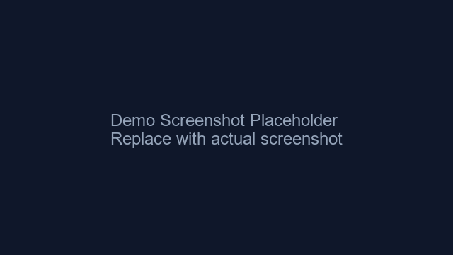

# Vibemotion —— 用 Hy3 生成科普动画

一个小玩具网站，输入任意科普主题，让 Hy3（混元大模型）生成一段会动的 p5.js 动画 + 解说词。

这个项目是 [Tencent-Hunyuan/Hy3#2](https://github.com/Tencent-Hunyuan/Hy3/issues/2) 的 Part B 小作品。

## 效果预览



> 主题：泰勒公式。Hy3 生成的动画用彩色圆环叠加来展示多项式逼近函数曲线的过程。

## 怎么跑起来

```bash
git clone https://github.com/xy200303/hy3-vibemotion.git
cd hy3-vibemotion
pip install -r requirements.txt
cp .env.example .env
# 编辑 .env 填入你的 Hy3 API 信息
python main.py
```

然后浏览器打开 `http://localhost:8000`。

## 怎么用

1. 在输入框里写个科普主题，比如：
   - `黑洞是怎么吞噬恒星的`
   - `地震波是怎么传播的`
   - `光合作用的过程`
   - `泰勒公式`
2. 选个 Vibe 风格（轻松 / 史诗 / 治愈）。
3. 点「生成动画」。
4. 等几秒，Hy3 会返回解说词和一段 p5.js 动画代码。
5. 动画会在页面上直接播放，点「重新播放」可以再看一遍。

## 实现思路

- **后端**：FastAPI 调用 Hy3 的 OpenAI-compatible API，让它根据主题生成 p5.js 动画代码。
- **代码校验**：生成的代码会检查括号配对、是否包含 setup/draw、有没有禁用 API（eval/fetch/document 等），不通过会重试 3 次。
- **兜底**：如果代码实在跑不通，会自动 fallback 到几个预设的 p5.js 模板。
- **前端**：原生 HTML/CSS/JS，动画在沙盒 iframe 里运行，避免代码问题影响主页面。
- **动画引擎**：[p5.js](https://p5js.org/)

## 文件结构

```
hy3-vibemotion/
├── main.py              # FastAPI 后端
├── static/
│   ├── index.html       # 页面
│   ├── style.css        # 样式
│   ├── app.js           # 前端逻辑
│   ├── animator.js      # 模板兜底动画
│   └── p5.min.js        # 本地 p5.js
├── assets/
│   └── demo.png         # 演示截图
├── requirements.txt
├── .env.example
└── README.md
```

## 配置

复制 `.env.example` 为 `.env`，三选一：

```bash
# 本地 vLLM/SGLang
HY3_BASE_URL=http://127.0.0.1:8000/v1
HY3_API_KEY=EMPTY
HY3_MODEL=hy3

# OpenRouter
# HY3_BASE_URL=https://openrouter.ai/api/v1
# HY3_API_KEY=sk-or-v1-...
# HY3_MODEL=tencent/hy3-295b-a21b

# 腾讯云 TokenHub
# HY3_BASE_URL=https://tokenhub.tencentmaas.com/v1
# HY3_API_KEY=your-tokenhub-key
# HY3_MODEL=hy3-preview
```

## 安全说明

生成的 p5.js 代码会在 sandbox iframe 里跑，不会直接访问父页面。如果还不放心，可以自己再加一层 CSP。

## Demo 视频 / GIF

TODO：录一段 ≤1 分钟的 demo 视频或 GIF，替换这里的占位说明。

录制方法：
1. 配置好 `.env` 并启动 `python main.py`。
2. 浏览器访问 `http://localhost:8000`。
3. 输入一个主题，点击生成，录屏。
4. 把视频/GIF 放到仓库里，更新本段说明。

## License

Apache License 2.0
